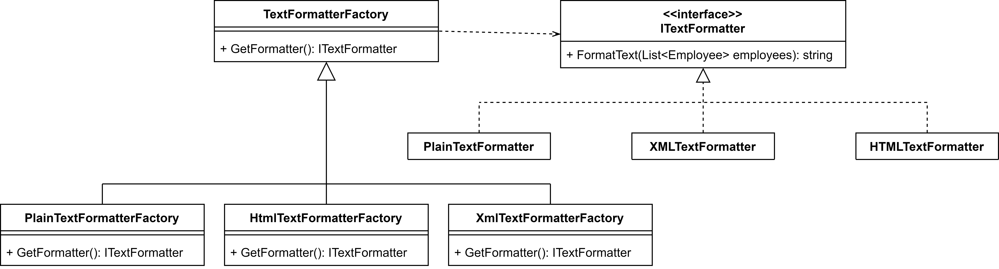
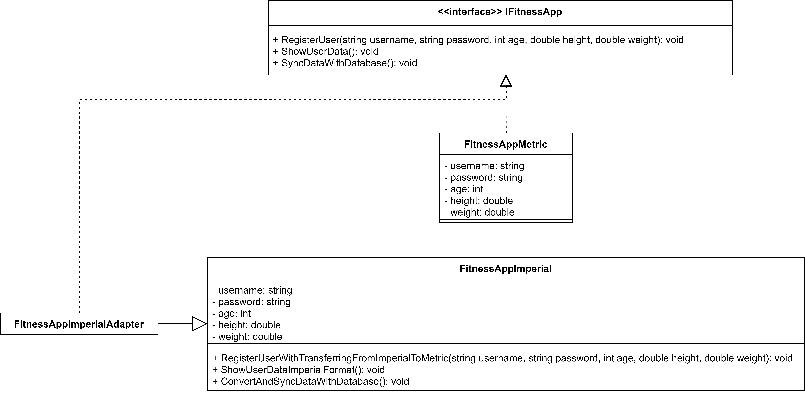
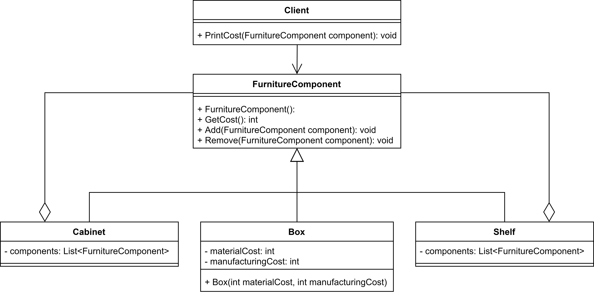

# MIKS

Images
## LR2
### LR2_1

### LR2_2

## LR3
### LR3_1

### LR3_2

## LR4
### LR4_1

### LR4_2

| № | IDE                | Programming language | Database           |
|---|--------------------|-----------------------|--------------------|
| 18| Visual Studio 2022 | C#                    | Microsoft SQL Server|
